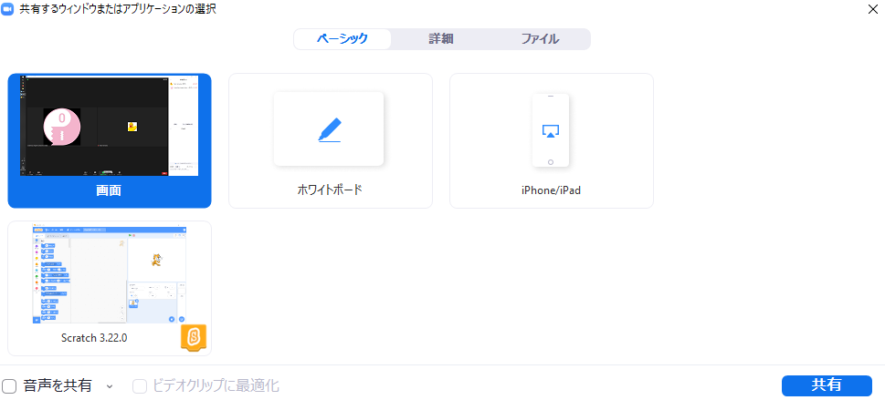

<!-- _class: lead -->

# [CoderDojoとは...](https://docs.google.com/presentation/d/13t5P1gojsde_gvcvDnPsfHYIqsS-knqWGDxyh3eG8SU/edit#slide=id.p)

---
# :timer_clock: じかんわり :timer_clock:

13:40 ~ 14:10 :computer: プログラミング、ワークショップ

14:10 ~ 14:20 :tea: きゅうけい

14:20 ~ 14:50 :computer: プログラミング、ワークショップ(つづき）

14:50 ~ 15:20 :tada: 作品発表 (希望するニンジャのみ、とちゅうでも :+1:)

14:20 ~ 14:30 :wave: またねー

---
# 発表のしかた

- マイクをONにしてください
    - 
- Zoom画面の下側にある をおしてください
    - アイコンが出た時は

---
# 画面をえらぶ

画面全体をえらんでください。
