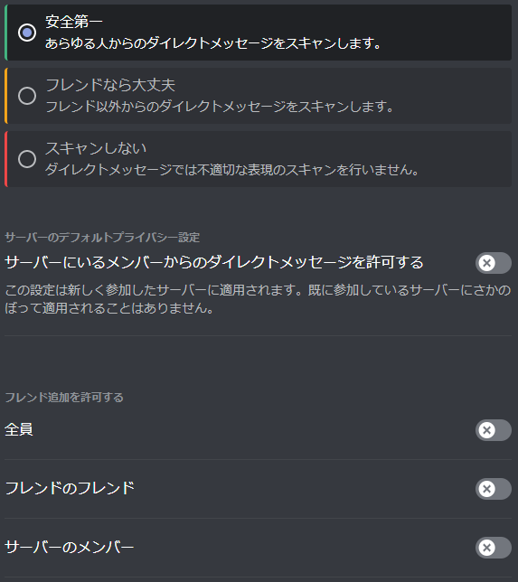

[Discord]: https://discord.com

オンラインでイベントを行う時は[Discord]を使います。  またDiscordで質問や発表も出来ます。

このページではDiscordの始め方を説明します。

# 1. ソフトウェアのインストール

[Discord]のサイトへアクセスすると上記のようなボタンがあるので、お好きな方を選んで下さい。

このページを見てるブラウザ(Chrome, Edge, SafariならOK)のままでも使えますが、インストールすると少しだけ使いやすくなります。利用頻度や必要に応じて選んで頂ければ良いと思います。

ダウンロードを行った場合は、保存したファイルを実行してインストールを完了させて下さい。

# 2. Discordアカウント作成

## 2.1. その前に

13歳未満のお子さんは保護者の方がアカウントを作成する必要があります。また、13才以上の未成年でも保護者の同意が必要になります。

アカウント作成にはメールアドレスか電話番号が必要になりますが、[Discord]からのメッセージがメールや電話番号へ通知されることはありません。

あと登録のときに、時々次のような画面が出ます。その時は赤で印をした部分をクリックして、案内に従って下さい。

## 2.2. アカウント作成

Dicordを開くと次のような画面が出ます。

このページを見てる方は[Discord]は始めてだと思うので、赤で印をした"登録"をクリックして下さい。

すると次のような画面が出てくると思います。

ここに、下記の情報を記入して"はい"を押してください。

- メールアドレス
- ユーザー名
    - 好きな名前を入れて下さい。後で変更も出来ます。
- パスワード
- 生年月日
    - 13未満の子供の場合は、必ず保護者の生年月日を設定して下さい。

記入して"はい”を押すと、次のような画面が出る時があります。

好きな方を選択して認証を完了させて下さい。

認証が完了すると、Discordへログインが自動で行われます。

# 3. 安全に使うための設定

[Discord]を安全に使うための設定を行います。

[Discord]にログインすると、画面の左下に次のようなアイコンが並んでる思います。

ユーザーの設定を行うため、赤で印をした:gear:マークをクリックして下さい。

ユーザー設定画面が表示されるので、左のリストから"プライバシー・安全"を選択して下さい。

すると右側の表示が変わるので、次の画像と同じになるように設定して下さい。

設定によっては次のようなポップアップが出るので"はい"を選択して下さい。  
間違えた場合は、一度戻して再度同じ設定を試せば出てきます。

設定が完了したら、右上の"X"ボタンかESCキーを押して画面を抜けます。

# 4. CoderDojo東住吉のサーバーへ参加

[Discord]はサーバーと呼ばれるグループに参加することで、そのグループに参加してるメンバとコミュニケーションを取ることが出来ます。

下のリンクをクリックして、CoderDojo東住吉のサーバーへ参加して準備完了です。

<a href="https://discord.gg/sT6K3bspqz" target="_blank" rel="noopener noreferrer" class="button special">
CoderDojo東住吉 Discordサーバー
</a>

