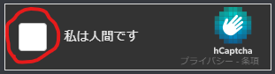
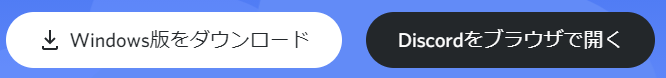
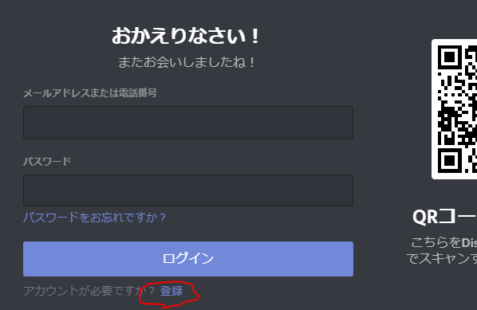
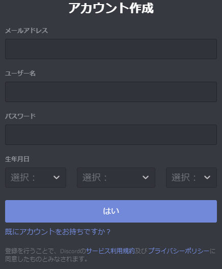
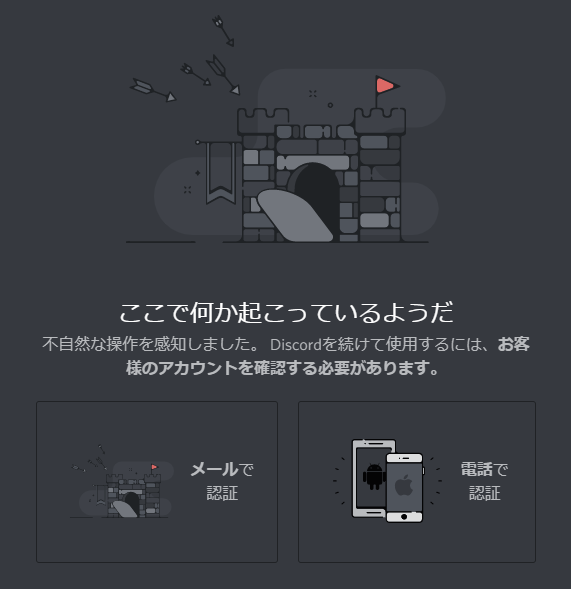
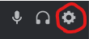
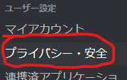
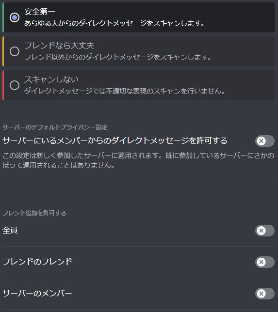
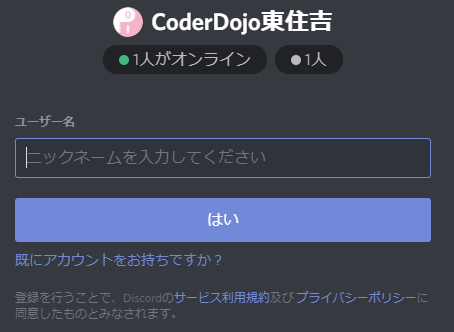

オンライン開催の時はDiscordを使います。Discord]を使うとオンラインで質問や発表が出来ます。

このページではDiscord]の始め方を説明します。

## 0. その前にご確認下さい

13歳未満のお子さんは保護者の方がアカウントを作成する必要があります。また、13才以上の未成年は保護者の同意が必要になります。

本人確認のためにアカウント作成にはメールアドレスか電話番号が必要になりますが、登録したメールや電話番号は公開されません。また本人確認完了後はDiscordから通知が送信されることもありません。

あと登録のときに、時々次の様な画面が出ます。その時は赤で印をした部分をクリックして、案内に従って下さい。

# 1. ソフトウェアのインストール (または環境の選択)

下記リンクからDiscordのサイトへアクセスすると上の画像の様なボタンがあると思います。見つけたら環境に合わせて選択して下さい。  
このページを見てるブラウザ(Chrome, Edge, SafariならOK)のままでも使えますが、インストールすると少しだけ使いやすくなります。利用頻度や必要に応じて選んで頂ければ良いと思います。

- [Discord]: https://discord.com

ダウンロードを行った場合は、保存したファイルを実行してインストールを完了させて下さい。

# 2. Discordアカウント作成

Dicordを開くと下の様な画面が出ます。

このページを見てる方はDiscordは始めてだと思うので、赤で印をした"登録"をクリックして下さい。

すると入力が画面が出てくると思います。

この入力画面から下記の情報を記入して下さい。  
13未満のお子さんの場合は、必ず保護者のアカウントとして登録して下さい。

- メールアドレス
- ユーザー名
    - 好きな名前を入れて下さい。後で変更も出来ます。
- パスワード
- 生年月日

記入して"はい”を押すと、次の様な画面が出る時があります。

好きな方を選択して認証を完了させて下さい。

認証が完了すると、Discordへ自動でログインされます。

# 3. 安全に使うための設定

Discordを安全に使うための設定を行います。

Discordにログインした画面を開いて、画面左下から次の画像の様なアイコンを探して下さい。

見つけたら、赤で印をした:gear:マークをクリック。

ユーザー設定画面が表示されるので、上の画像の様な"プライバシー・安全"を左のリストから選択。

すると右側の表示内容が変わるので、下の画像と同じになる様に設定して下さい。

下画像の様なポップアップが出た時は、"はい"を選択して下さい。  
間違えた場合は、一度設定を戻してもう一度同じ設定を行って下さい。

設定が完了したら、右上の"X"ボタンかESCキーを押して画面を抜けます。

# 4. CoderDojo東住吉のサーバーへ参加

あともう一息です。  
Discordはサーバーと呼ばれるグループに参加することで、そのグループに参加してるメンバとオープンにコミュニケーションを取ることが出来ます。

CoderDojo東住吉のサーバーへ参加するために、下のリンクをクリックして下さい。

<a href="https://discord.gg/sT6K3bspqz" target="_blank" rel="noopener noreferrer" class="button special">
CoderDojo東住吉 Discordサーバー
</a>

下の画像のような招待画面が出るので、"招待を受ける"ボタンをクリックして参加完了です。  

パソコンによってはエラーが出る場合がありますが、その時は気にせず画面に出てる"Discordで開く"ボタンを押して下さい。CoderDojo東住吉のサーバー画面になると思います。

