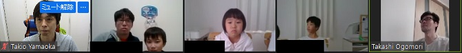
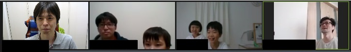

[【オンライン開催】プログラミングで遊ぼう！ CoderDojo 東住吉 1回目](https://cd-hisumi.doorkeeper.jp/events/121104)

- `2`名の**メンター**
- `3`名の**ニンジャ**

が来てくれました :tada:

CoderDojo 東住吉の初めての道場になります。また今回は、Zoomを使ってオンライン開催の道場となりました。

# :timer_clock: 当日のスケジュール

| 時間                  | 内容                                                          |
|-----------------------|---------------------------------------------------------------|
| 13:30 ~ 13:40 (10min) | 1. :clipboard: オープニング                                   |
| 13:40 ~ 14:40 (60min) | 2. :computer: プログラミング、ワークショップ                  |
| 14:40 ~ 15:10 (30min) | 3. :hammer_and_wrench: 自由時間 (きゅうけい、プログラミング)  |
| 15:10 ~ 15:25 (15min) | 4. :tada: 作品発表 (希望するニンジャのみ、とちゅうでも :ok: ) |
| 15:25 ~ 15:30 ( 5min) | 5. :wave: クロージング、記念撮影                              |

# レポート

## 1. :clipboard: オープニング

最初は簡単にCoderDojoJapanが用意する説明スライドを使って、CoderDojoの説明を行いました。

- [CoderDojo へようこそ](https://docs.google.com/presentation/d/13t5P1gojsde_gvcvDnPsfHYIqsS-knqWGDxyh3eG8SU/edit#slide=id.p)

チャンピオンの[`やまおか`](https://github.com/ytakio)も初めての道場開催なので、上手く説明できたか心配です :sweat_drops:

---
## 2. :computer: プログラミング、ワークショップ

CoderDojoに初めて参加するニンジャも最初は見学で参加していましたが、ポケモンのワークショップを一緒にしてくれました。

またメンターで参加してくれた[CoderDojo 大阪狭山・本町](https://coderdojo-hommachi.github.io/)チャンピオンの`おごもり`さんが、ワークショップを進めてくれました :sparkles:

### **2.2. ピカチュウを うごかそう**

ポケモンのワークショップは、最初はピカチュウを動かすプログラミングを一緒に行いました。

CoderDojoに参加するのが初めてのニンジャも居るので、ファイル読み込みとか上手く出来るかなと心配でしたが、スムーズに始めれました :tada:

ブロックをつなげて、ピカチュウを歩かせるプログラミングです。

### **2.3. ポケモンを つかまえよう**

ピカチュウが動かせるようになったら、モンスターボールとポケモンを読み込んで、ポケモンを捕まえるプログラミングをします。

ここから、たくさんのスクラッチ・ブロックを一緒につなげます...

みんな真剣...:eyes:

ワークショップを一通り終えると。モンスターボールでポケモンを捕まえるプログラミングが完成しました :tada:

## 3. :hammer_and_wrench: 自由時間 (きゅうけい、プログラミング)

ポケモンのワークショップを一通り終えると、基本的なプログラミングが出来るようになります。

ここからは、みんな自分のしたいプログラミングをしたり、自由に休憩をとったりしました。

メンターも今回は発表しようと、もくもくとプログラミングをしていました :laughing:

## 4. :tada: 作品発表 (希望するニンジャのみ、とちゅうでも :ok: ) 

今回はメンターの2人が発表を行いました。 (ニンジャはオンラインだし、ちょと恥ずかしかったみたいです:flushed:)

### **発表 1番目**

最初の発表はチャンピオンの`やまおか`が発表を行いました。

ワークショップで作った、「ポケモンを つかまえよう」のプログラミングに [micro:bit(マイクロビット)](https://microbit.org/)を使ってモンスターボールを操作出来るようにしました。

マイクロビットが、かたむいた方向にモンスターボールが動きます。

またマイクロビットのボタンを使って、こんなプログラミングもしました。

- Aボタンを押すとモンスターボールが飛んで、当たるとポケモンをゲット
- Bボタンでピカチュウを出す

少しバグがあって、Aボタンを連打するとモンスターボールが凄いことになります :scream:

また、つかまえたポケモンの数をマイクロビット側にも表示するようにしてみました。

### **発表 2番目**

二人目の発表は、[CoderDojo 大阪狭山・本町](https://coderdojo-hommachi.github.io/)チャンピオンの`おごもり`さんが発表を行いました。

こちらも、ワークショップで作った「ポケモンを つかまえよう」のプログラミングを、スクラッチ・ブロックの`クローンする`を使ったプログラミングを見せてくれました。

ピカチュウが歩きながら、どんどん分身していました。少し待つと、画面いっぱいにピカチュウが... :exclamation: すごい光景です。

ここでモンスターボールを動かすと、ものすごい数のピカチュウをつかまえることが出来ました。

ニンジャ達も、大爆笑 :laughing: (少し時間をおいてみたら、1,000匹を超えてました)

またスクラッチの`ていぎ`の使い方も、説明してくれました。

`クローンする`を使うと、スクラッチで出来る事が一気に増えるので、こういった発表はニンジャの刺激になりそう :smile:

## 5. :wave: クロージング、記念撮影

最後に、記念撮影をしました。

1回目の道場でしたが、ニンジャもメンターも集まって、みんな楽しんでた様子で良かったです。

またきてねー :wave: 来月も出来たらいいな :thinking:
