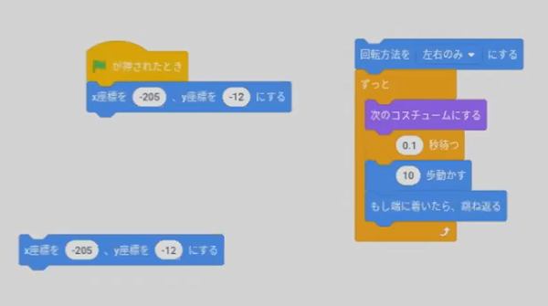
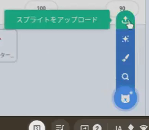
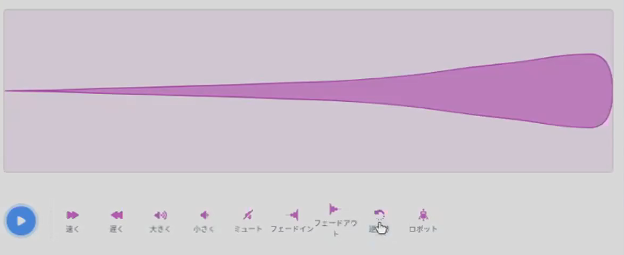
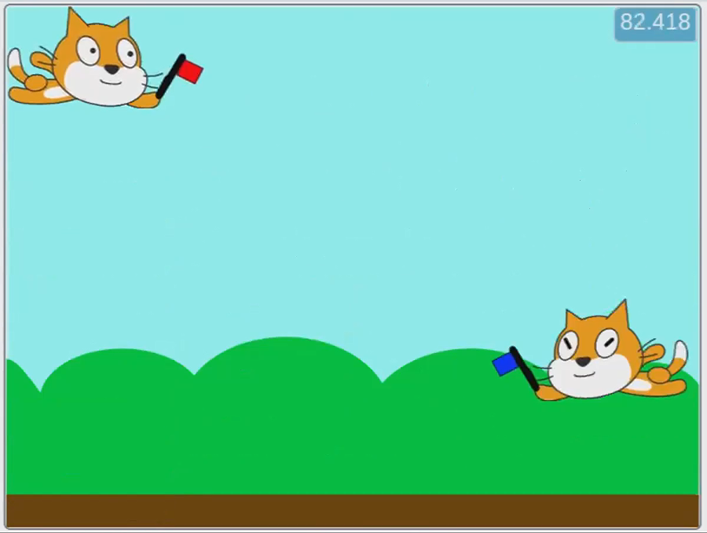
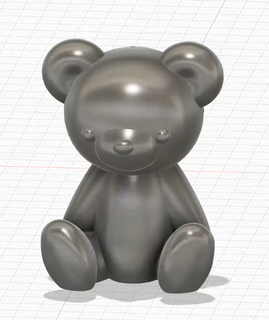

[【オンライン開催】プログラミングで遊ぼう！ CoderDojo 東住吉 2回目](https://cd-hisumi.doorkeeper.jp/events/122427)

- `2`名の**メンター**
- `2`名の**ニンジャ**

が来てくれました :tada:

今回の道場もZoomを使ってオンライン開催となりました。

# :timer_clock: 当日のスケジュール

| 時間                  | 内容                                                          |
|-----------------------|---------------------------------------------------------------|
| 13:30 ~ 13:35 ( 5min) | 1. :clipboard: オープニング                                   |
| 13:35 ~ 14:30 (55min) | 2. :computer: プログラミング、ワークショップ                  |
| 14:40 ~ 15:10 (30min) | 3. :hammer_and_wrench: 自由時間 (きゅうけい、プログラミング)  |
| 15:10 ~ 15:25 (15min) | 4. :tada: 作品発表 (希望するニンジャのみ、とちゅうでも :ok: ) |
| 15:25 ~ 15:30 ( 5min) | 5. :wave: クロージング、記念撮影                              |

# レポート

## 1. :clipboard: オープニング

前回も参加したニンジャのみだったので、オープニングは程々にして、早々とプログラミングをはじめました。  

---
## 2. :computer: プログラミング、ワークショップ

前回途中で接続が切れてしまったニンジャが、今回もポケモンのワークショップを希望したので一緒にプログラミングをしました。  

もう一人のニンジャは、スクラッチでゲームを作りたい様で黙々とプログラミングをしていました。

### **2.2. ピカチュウを うごかそう**

最初はピカチュウを動かすプログラミングです。

ピカチュウが画面端を超えると見えなくなるので、緑フラッグボタンを押すと最初の場所に戻すブロックを入れて工夫してプログラミングをしてくれました。

### **2.3. ポケモンを つかまえよう**

ピカチュウを動かせるようになったので、次はモンスターボールを使ってポケモンを捕まえるプログラミングを一緒にしていきます。

「プログラミングでポケモンをうごかしてみよう」のワークショップで使う素材ファイルには沢山のポケモンが入ってるので、一つずつ読み込んで行きます。

読み込めたら、まずはピカチュウだけにモンスターボールが触れたら隠れるプログラミングをして、同じプログラミングを他のポケモンにコピーして完成。

途中でニンジャがポケモンを捕まえた時の音を変える事を思いつくなど、色々とアイデアを詰めながらプログラミングが出来ました。

## 3. :hammer_and_wrench: 自由時間 (きゅうけい、プログラミング)

10分ほど休憩を入れて、プログラミング再開です。

ポケモンのワークショップを一緒にやったニンジャは、イーブイとピカチュウを使って何か新しい作品を作りはじめました。

もう一人のニンジャも、もくもくとプログラミング :eyes:

## 4. :tada: 作品発表 (希望するニンジャのみ、とちゅうでも :ok: ) 

今回はニンジャ2人と、メンター1人が発表を行ってくれました。

### **発表 1番目**

発表1番目は、もくもくとゲームを作っていたニンジャが発表してくれました。

作っていたのは「鬼ごっこゲーム」で、相手にタッチしたら交代で、100秒経過した特に鬼だった人が負けというルールでプログラミングをしたとのこと。

面白いのは、同じ速さだと追いつけないので、キャラクター毎に方向で少し速さを変えてると話してくれました。見えない所にも考えられた工夫があってびっくり。

また同じキーボードで二人同時に操作出来るようにプログラミングもしていました。肩を並べてゲームが出来るのは楽しいですよね:smile:

次はキャラクターの大きさを変えたり、1人用モードも作ってみたいと言っていました。

### **発表 2番目**

次は一緒にポケモンのワークショップをやってくれたニンジャの発表です。

イーブイを使ったアニメーションを発表してくれました。

イーブイが奥から手前に歩いて来て、少しずつ大きくなる用にプログラミングしたのを見せてくれました。

一番手前にイーブイが来ると、ピカチュウが現れました。モンスターボールからピカチュウが現れてバトルが始まるところを作りたかったとのこと。

現実世界の見え方の通りにプログラミングをするのが大変だったと教えてくれました。初めてだけど、頑張って発表してくれました :tada:

ブロックが沢山あって、どれを使えばいいか難しかったと感想を話してくれました。

### **発表 3番目**

最後の発表は、今回もメンターとして参加してくれた [CoderDojo 大阪狭山・本町](https://coderdojo-hommachi.github.io/) チャンピオンの`おごもりさん`からの発表です。

なんと3Dモデリングをしてて、その内容を見せてくれました。

`Fusion 360`というソフトを使って制作してると教えてくれました。

なんと個人用なら無償版があるそうです！

- [個人用 Fusion 360](https://www.autodesk.co.jp/products/fusion-360/personal)

少しずつ違う「くまさん」や、駐車場等においてある「ロードコーン」など色々見せてくれました。

ねんどみたいに形を作ったり、金属みたいに形を組み合わせたりと、作り方も教えてくれました。

作ったモデルは3Dプリンタで出力も出来るとのことで、ニンジャも私も目が釘付けでした（笑）

3Dプリンタ欲しい。。。

## 5. :wave: クロージング、記念撮影

2回目でオンラインという事もあって、今回も少人数の道場でした。それでもワークショップ中にニンジャが色々と工夫を入れたり、ニンジャが発表してくれたりと楽しい時間になりました。

次回はそろそろ、オフライン(どこかの会場)で出来たら良いなと思います。まだ日程や場所も未定ですが、プログラミングや工作に興味のある子は是非遊びに来てくださいねー

