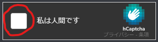
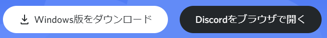
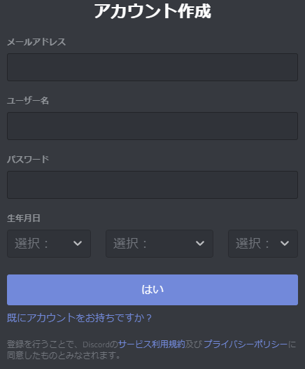
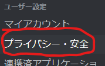
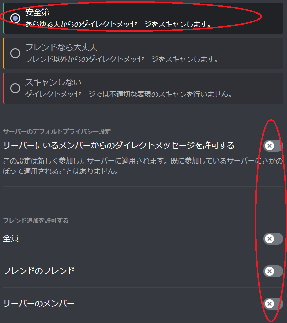
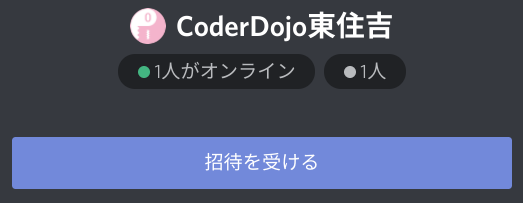

このページではDiscordの始め方を説明します。  

Discordはチャットやオンライン会議が出来る無料のアプリです。

CoderDojoがオンライン開催の時は、Discordを使って質問や発表が出来るので、オンライン会議に使えるデバイス(パソコン/タブレット/スマートフォン)上でDiscordを使う準備をお願いします。

Discordをお使いになるデバイスで、このページを見るとスムーズに始めれると思います。

# 0. はじめに

13歳未満のお子さんは**保護者の方が利用するアカウント**を作成する必要があります。  
13才以上で未成年のお子さんは自分でアカウントを作成出来ますが、保護者の同意が必要になります。

本人確認のためにアカウント作成にはメールアドレスか電話番号が必要になりますが、登録したメールや電話番号は公開されません。また本人確認完了後はDiscordから通知が送信されることもありません。

あと登録のときに、時々次の様な画面が出ます。その時は赤で印をした部分をクリックして案内に従って下さい。

# 1. アプリのインストール

下記リンクからDiscordサイトにアクセスして下さい。

<a href="https://discord.com" target="_blank" rel="noopener noreferrer" class="button special">
Discord
</a>

すると下の画像の様なボタンが見つかると思います。

下記を参考に、使いたい方を選んで下さい。

- "○○○ ダウンロード"
    - Discord専用アプリをインストールします。
    - スマートフォンやタブレットの方はこちらを選択して下さい。
- "Discordをブラウザで開く"
    - このページを見てるアプリ(Chrome, Edge, SafariならOK)の中でDiscordを使います。
    - アプリをインストールしたくない場合はこちらを選択して下さい。

ダウンロードでファイルを保存した場合は、ファイルを実行してインストールを完了させて下さい。

# 2. Discordアカウント作成

Dicordを開くと下の様な画面が出ます。

このページを見てる方はDiscordは始めてだと思うので、赤で印をした"登録"をクリックして下さい。

すると入力が画面が出てくると思います。

この入力画面から下記の情報を記入して下さい。  
13未満のお子さんは、必ず**保護者方が保護者として**アカウントを作成して下さい。

- メールアドレス
- ユーザー名
    - 好きな名前を入れて下さい。後で変更も出来ます。
- パスワード
- 生年月日

記入して"はい”を押すと、次の様な画面が出る時があります。

使いたい方を選択して認証を完了させて下さい。認証のメールやメッセージは別のパソコン・スマートフォンで行っても問題ありません。

認証が完了すると、Discordへ自動でログインされます。

# 3. 安全に使うための設定

Discordを安全に使うための設定を行います。

Discordにログインした画面を開いて、画面左下から次の画像の様なアイコンを探して下さい。

見つけたら、赤で印をした:gear:マークをクリック。

ユーザー設定画面が表示されるので、上の画像の様な"プライバシー・安全"を左のリストから選択。

すると右側の表示内容が変わるので、下の画像と同じになる様に設定して下さい。

下画像の様なポップアップが出た時は、"はい"を選択して下さい。  
間違えた場合は、一度設定を戻してもう一度同じ設定を行って下さい。

設定が完了したら、右上の"X"ボタンかESCキーを押して画面を抜けます。

# 4. CoderDojo東住吉のグループに参加

あともう一息です。  
Discordはグループに参加することで、参加してるメンバとオープンにコミュニケーションを取ることが出来ます。
(Discordではサーバーと呼んでいます)

CoderDojo東住吉のグループに参加するために、下のリンクをクリックして下さい。

<a href="https://discord.gg/sT6K3bspqz" target="_blank" rel="noopener noreferrer" class="button special">
CoderDojo東住吉 | Discord
</a>

下の画像のような招待画面が出るので、"招待を受ける"ボタンをクリックして参加完了です。

パソコンによってはエラーが出る場合がありますが、その時は気にせず画面に出てる"Discordで開く"ボタンを押して下さい。CoderDojo東住吉の画面になると思います。

